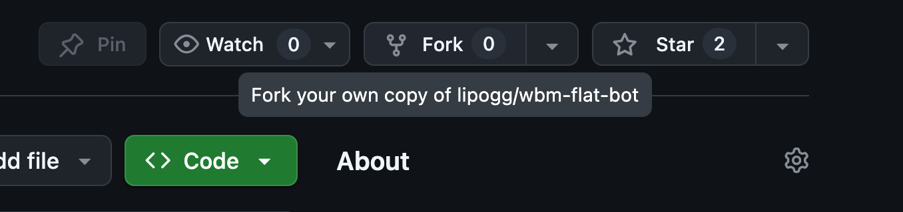
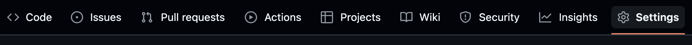
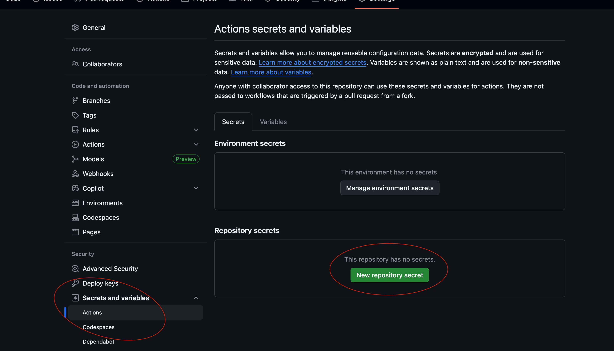
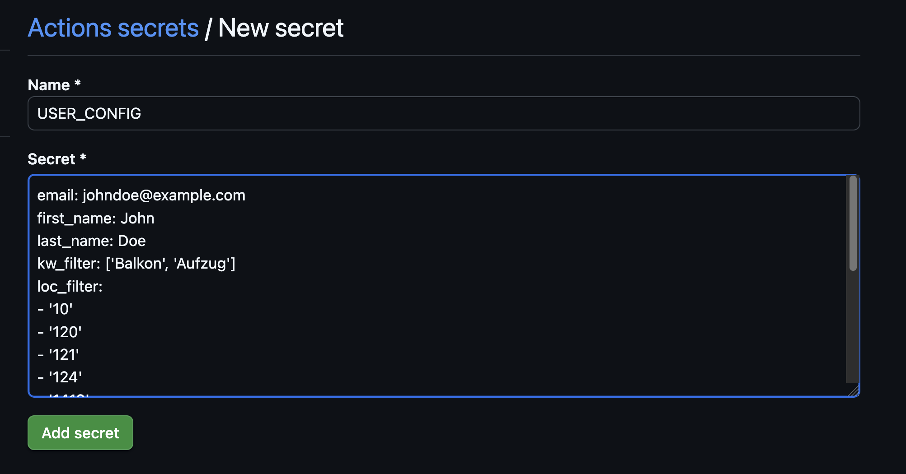
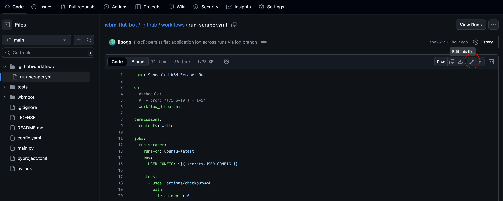
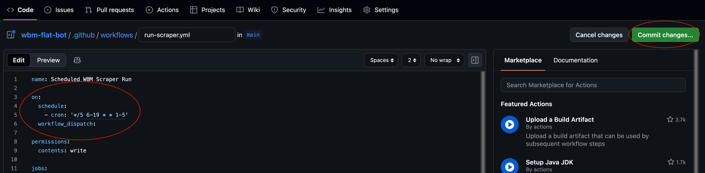

# WBM Flat Bot

Python bot that automates flat search and application for flats by WBM Wohnungsbaugesellschaft Berlin-Mitte. 

## Features 

- Search flats by zip code, flat size, minimum room number, maximum rent (more to come)
- Filter flats by net household income and net base rent ratio. WBM only considers applicants with net household income between 15% and 30% of the net base rent: https://www.antidiskriminierungsstelle.de/SharedDocs/praxisbeispiele/DE/wohnungsmarkt/praxisbeispiel-wbm.html
- Apply automatically via application form and log applications

It is not yet possible to search for WBS flats, but this feature will be implemented soon.

This bot tries to scrape flats responsibly by offering more filter options than preexisting WBM flat bots, without sacrificing too much speed, since speed is crucial for being considered in the WBM application process. 
It does not require local installation and aims to be accessible to people with little coding experience. 

## Background

Flats are posted on weekdays at https://www.wbm.de/wohnungen-berlin/angebote/. To apply for a flat, the form at the bottom of each listing page must be filled out. This is what this bot does for you. The form asks for full name and email address, and, if applicable, details about a Wohnberechtigungsschein (WBS). 
Sometimes WBM sends a follow-up email shortly after the application is submitted, asking for confirmation, which has to be confirmed manually. 
Once a listing is taken offline, WBM follows up via email. If the application was submitted too late, applicants receive a rejection notice. If the application was submitted fast enough, applicants receive an exposé along with a link to a more detailed form (Selbstauskunftformular). This second form must be filled out within 24 hours. 
If the application meets WBM's criteria, the applicant may be invited to a flat viewing. 

WBM generally aims for a 1:1 room/tenant ratio, so please set a realistic minimum room number in your search criteria. An application from a single person for a three-bedroom flat is guaranteed not to be considered.

## Usage

1. Fork this repository
2. In your forked repository, go to *Settings* -> *Secrets and variables* -> *Actions* -> *Secrets* and set up a new *Repository secret* called `USER_CONFIG`. Paste the content of the sample config.yaml file in the window and adapt to your needs (replace email, name, search criteria). 
3. Remove comments in front of "schedule" and "- cron: '*/5 6-19 * * 1-5'" in the file `.github/workflows/run-scraper.yml` 
4. Go to repository *Actions* tab and verify that everything is running correctly. It may take a few minutes until the scheduled run is triggered, but you can also trigger the run manually if you don't want to wait. Once the first run is complete, click on the run, scroll down to *Artifacts* and download logs (the artifact is called `scraper-logs`). `flats.log` contains flats that have been applied to. This is empty if no flats were found. `app.log` logs scraping process and flats that did not match criteria.
5. Don't forget to delete your fork, remove the file `.github/workflows/run-scraper.yml` or comment out the "schedule" and "- cron: '*/5 6-19 * * 1-5'" bit when your flat search is over!  

Although the workflow is scheduled to run every 5 minutes, GitHub Actions may experience server-side delays, so the actual interval is closer to 15 minutes.

*Your email address, full name and household net income will be sent to GitHub servers if you use this bot. However, since your data is stored in a repository secret, it is encrypted before it reaches GitHub (see [GitHub documentation pages](https://docs.github.com/en/actions/concepts/security/secrets) for more information). Since the rent levels of flats applied for could allow inferences about your net household income, this information is removed from the flat applications log file, which is public if the repository is public.*

## Detailed Usage Instructions 

If you are new to coding and GitHub, you may find the following more detailed instructions helpful.

**1. Fork this repository**

To fork the repository, click on the *Fork* button at the top right of the repository main page: 

This opens a new window. You do not need to change anything here, just click on "Create Fork".

**2. In your forked repository, go to *Settings* -> *Secrets and variables* -> *Actions* -> *Secrets* and set up a new *Repository secret* called `USER_CONFIG`.** 

**Paste the content of the sample config.yaml file in the window and adapt to your needs (replace email, name, search criteria).** 

Make sure you follow the format of the file exactly, i.e. include spaces where the sample config file had spaces, use the same symbols and don't change indentation. 
`loc_filter` is meant for zip codes and prefixes of zip codes for areas you would like to restrict your flat search to.
`kw_filter` is meant for other search criteria. Keywords can be any of the following: 
- Bad mit Wanne
- Bad mit Fenster
- Aufzug
- Offene Küche
- Balkon
- Barrierearm 
- (more will be added soon).

You can use any keywords that are commonly featured on the WBM flat listing page https://www.wbm.de/wohnungen-berlin/angebote/. 

**3. Remove comments in front of "schedule" and "- cron: '*/5 6-19 * * 1-5'" in the file `.github/workflows/run-scraper.yml`** 

To edit this file, first open the file by navigating from the main page of the repository to `.github` -> `workflows` -> `run_scraper.yml`.

Make sure you just remove the `#` symbols, do not change anything else. 

After making your changes, click on the "Commit changes..." button in the top right corner. This opens a new window. Again, you do not need to change anything here, just confirm with "Commit changes".
